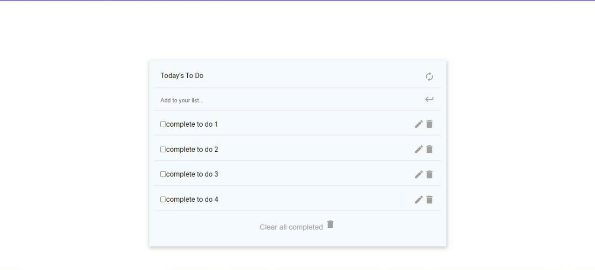

# To-do-list

A simple yet powerful to-do list, inspired by the minimalist website.
![image]

## Live Demo

[Live Demo Link]

## Built With

- HTML
- CSS
- JS
- WEBPACK

## Project requirements

- Set up a new project with webpack that is based on the webpack exercise you have already completed.
- Create an index.html file and write your HTML markup here. Create an empty To Do List placeholder (`<div>` or `<ul>` element). The index.html file must be set as a template using the HTML Webpack Plugin.
- Create an index.js file and set an array of some simple to do tasks (array of objects). Each task object should contain three keys:
  - description [string].
  - completed [bool].
  - index: [number].
- Write a function to iterate over the tasks array and populate an HTML list item element for each task.
- On page load render the dynamically created list of tasks in the dedicated placeholder. The list should apear in order of the index values for each task.
- Create a style.css and set rules for the To Do List. CSS must be loaded by Webpack Style/CSS Loader. Your list should be a clone of the part of the minimalist project captured in the video below. [link to video](https://www.youtube.com/watch?v=AcUd-_Yjjqg)
- All your source files (index.html, index.js and style.css) must be located in /src directory and your distribution files will be generated by webpack and served by webpack dev server from /dist folder.

## Getting Started

**To clone this project**
**Run command: $git clone the reposiratory**
**or press the green Code button in the upper right corner and choose to download from the Download ZIP link.**
**To setup the webpack for this project**
#### Install Webpack
- Follow the instructions from the [getting started](https://webpack.js.org/guides/getting-started/#basic-setup) guide to set up the basics. Implement all the steps from *Basic Setup* to *NPM Scripts*.
- The next step is to add html file :
    Follow the instructions from the [setting up HtmlWebpackPlugin](https://webpack.js.org/guides/output-management/#setting-up-htmlwebpackplugin) guide
Then
```
npm run build
```
- Create a **/src/index.html** for writing the project

- Then modify **webpack.config.js** to point HtmlWebpackPlugin towards your template file:
```javascript
plugins: [
  new HtmlWebpackPlugin({
-   title: 'Output Management',
+   template: './src/index.html'
  }),
],
```
- Run `npm run build` to update the **/dist/index.html**.
- Then it is time to add some style to the project:
Follow the steps in [loading CSS](https://webpack.js.org/guides/asset-management/#loading-css) guide.
Next, execute `npm run build` and check if the HTML body style has changed.
#### Setup local dev server
- Finally,follow the [using webpack-dev-server](https://webpack.js.org/guides/development/#using-webpack-dev-server) guide and set it up on your local machine.

## Prerequisites

- Code editor (VS Code)

## Authors

👤 Somdotta Sarkar


- GitHub: [@farouqdaif1](https://github.com/farouqdaif1)
- Twitter: [@farouqdaif](https://twitter.com/farouqdaif)
- LinkedIn: [LinkedIn](https://www.linkedin.com/in/farouqdaif/https://www.linkedin.com/in/farouqdaif/)

## Show your support

Give a ⭐️ if you like this project!

## 📝 License

This project is [MIT](./MIT.md) licensed.
